# Automated Complaint Management Ticking System

## Table of Content

1. [Introduction](#Introduction)
2. [Installation Guide](#Installation-Guide)
   - [Required Software](#Required-Software)
   - [Installation Guide](#INstallation-Guide)
3. [User Manuel](#User-Manuel)
   - [Registration](#Registration)
     - [User Registration](#User-Registration)
     - [Cloud Engineer Registration](#cloud-Engineer-Registration)
     - [Admin Registration](#Admin-Registration)
   - [Login](#Login)
   - [User Roles](#User-Roles)
     - [Admin Role](#Admin-Role)
     - [Cloud Engineer Role](#Cloud-Engineer-Role)
     - [User Role](#User-Role)
4. [Notes](#Notes)
5. [Glossary](#Glossary)

## Introduction

## Installation Guide

For this app we will need [XAMPP](https://www.apachefriends.org/download.html) to setup the database MySQL and Apache Web server to run the php file.

### Required Software

- [XAMPP](https://www.apachefriends.org/download.html)
- [Git](https://git-scm.com/)

### Installation Steps

After installing Git and XAMPP clone the repo in the `htdocs` folder.

For MacOS go to `Users/username/Application/XAMPP/htdocs`


For Windows go to `C:/xampp/htdocs`


For Linux distor place the project in `/opt/lampp/htdocs/`

```bash
git clone https://github.com/jenilSavani155/Automated-Complaint-Management-Ticketing-System
```

Run MySQL Database and Apache Server from XAMPP on Manage Servers tab.


Open up MySQL by going to [`http://localhos t/phpmyadmin/`](http://localhost/phpmyadmin/) then import the `complaint.sql` file in this url [`http://localhost/phpmyadmin/index.php?route=/server/import`](http://localhost/phpmyadmin/index.php?route=/server/import) from the projects root folder. This will import the database we have created and all the tables in complaint database.


Now go to
[`http://localhost/Automated-Complaint-Management-Ticketing-System/index.php`](http://localhost/Automated-Complaint-Management-Ticketing-System/index.php)

The app is now up and running.

For hosting on the cloud please follow this document from official [XAMPP website](https://www.apachefriends.org/hosting.html)

## User Manuel

Go to [`http://localhost/Automated-Complaint-Management-Ticketing-System/index.php`](http://localhost/Automated-Complaint-Management-Ticketing-System/index.php)

Where you will be greeted by our Homepage.


As requested but the client we have divided the users in three different roles with different levels of authorities and functionalities.

### Registration

You can register as a User or a Cloud Engineer but you will need to wait for a while for the Admin to approve your account, you can contact your Admin after you have registered.

#### User Registration

To register as a user enter your `Full Name`, `Email`, `Password` that you want and confirm that password in the text boxes labeled respectively. Before you click on the registration button make sure the `Register As` has been set to`User`.

Here is an example.


The website will show this message if the registration was a success.


#### Cloud Engineer Registration

For a cloud engineer you can follow the above user registration but change the `Register As` to `Cloud Engineer`.
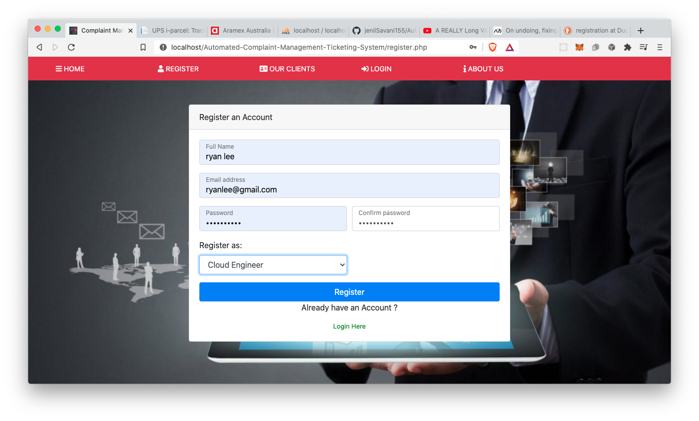

After that you will be see this message if there are no errors.


#### Admin Registration

For Admin we recommend to have them register right after they are registered. For this we will have to go through MySQL to add them. Go to [`http://localhost/phpmyadmin/index.php?route=/sql&server=1&db=complaint&table=admin&pos=0`](http://localhost/phpmyadmin/index.php?route=/sql&server=1&db=complaint&table=admin&pos=0) this is the table for admin accounts.

Click on `Insert` tab on the `Dashboard` to add a new admin.


After that add the `username`, `full_name` and the MD5 encrypted string of the password the admin wants for the account as shown below. For encryption we recommend this [website](https://www.md5online.org/md5-encrypt.html).

And click go that the end to add that account.

### Login

For Login go to [`http://localhost/Automated-Complaint-Management-Ticketing-System/login.php`](http://localhost/Automated-Complaint-Management-Ticketing-System/login.php)
For `Users` and `Cloud Engineer` you will have to use the email you have used to register and the password for that account you setup. Remember to login as a `User` please make sure the `Login As` has `User` selected as so with the `Cloud Engineer` make sure it is `Cloud Engineer`.

For `Admin` you will have to use `Username` for that profile and the password for it and don't forget to make sure you `Login as` an `Admin`.

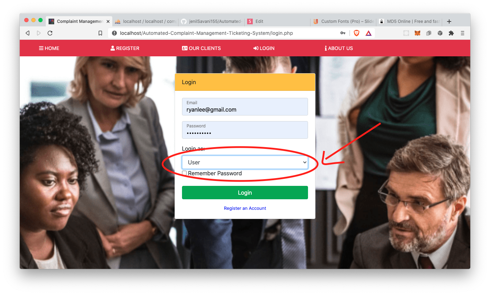

### User Roles

As above we have divided user roles in this app with them having different authority respectively.

#### Admin Role

On successful login of Admin, Admin dashboard is displayed which is as follows:
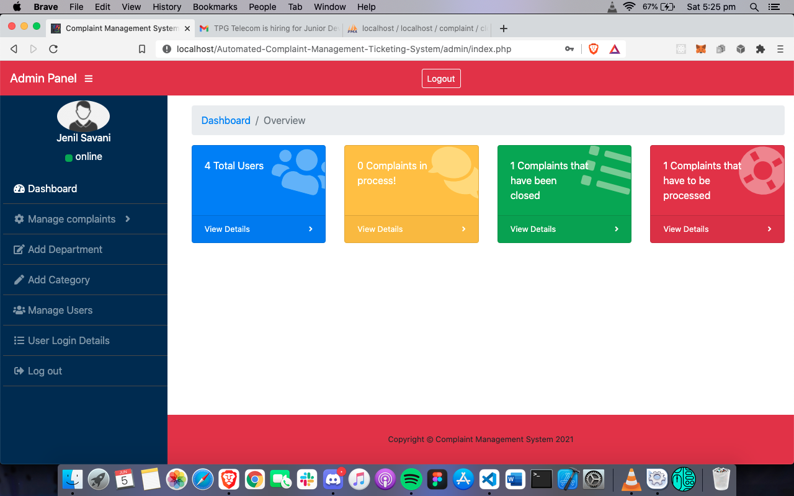

##### Manage user Complaints

To Manage new complaints, Admin can manage complaints by clicking onto the manage complaint button which is on the side navigation bar, or he can directly click onto the complaint status bar present on the main dashboard.
The following displays the no. of ways one can manage the complaints:
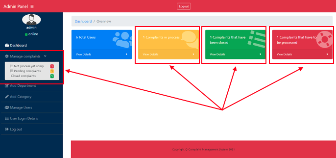

##### Assigning New Complaints to a Cloud Engineer

For Assigning new complaints to a cloud Engineer, Admin needs to click on to the “red status bar” or select the “manage complaints” button and then click on to “Not process yet comp”. On clicking those links, the following page is displayed:
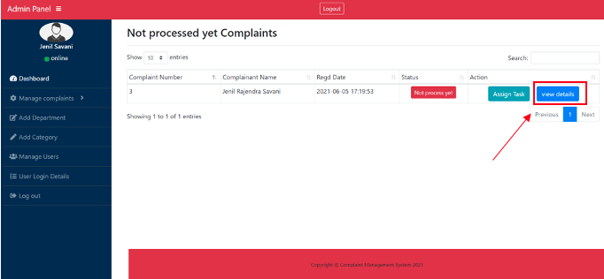

To assign cloud engineer, Admin first view the details of the complaint by clicking on to the “view details” button which is there in Blue coloured.
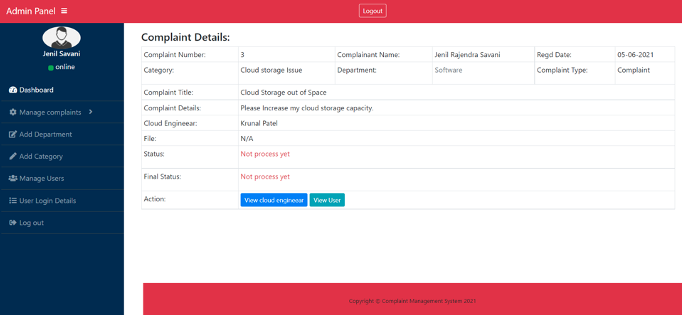

After Viewing the complaint details, Admin can now assign the complaint to a specific cloud engineer by clicking on to “Assign Task” Button which is placed next to not processed yet complaint button.
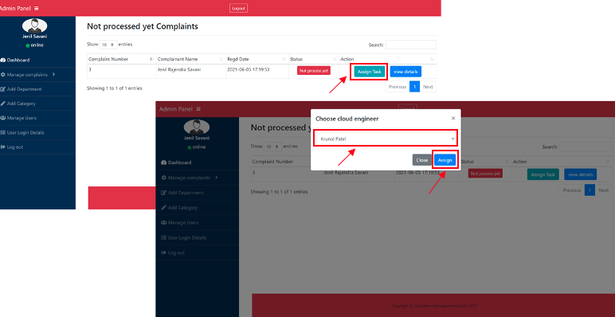

##### Edit Department

Admin has the authority to manage the department categories from his own dashboard.
To access this functionality, Admin needs to click on to the “Add Department” button which is located in admin’s dashboard through the side navigation panel.
On the next screen Admin can do the following tasks:

Delete the predefined department categories by clicking on to the red “Delete” button.

- Admin can edit those department categories by clicking on to the “edit” button.
- Admin can add the department by entering the department name and then clicking onto the “create” button.

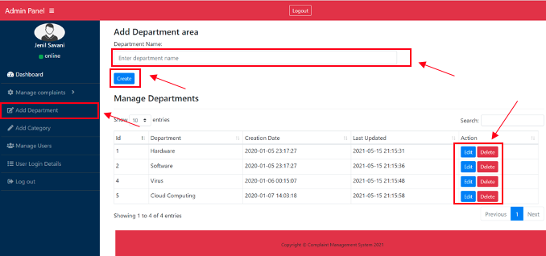

##### Edit Category

The category can be managed in same way as “department” is managed. The only thing that admin needs to do is to click on the “add Category”.
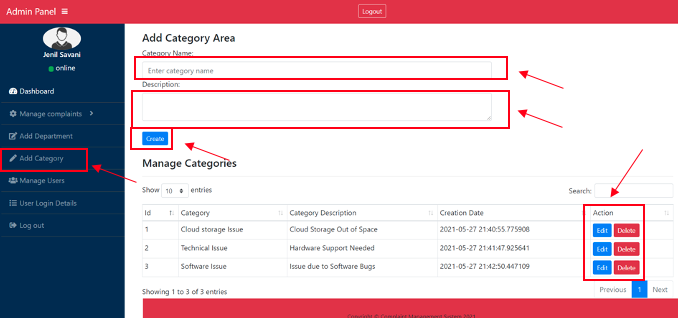

##### Manage Users

Admin has the authority to manage the user, which means Admin can Remove or view the users from the database or from the system.
To remove the users from the database, admin needs to click onto the “delete” button in the manage user page.
While to view the User Details, Admin needs to click onto the “View details” link.
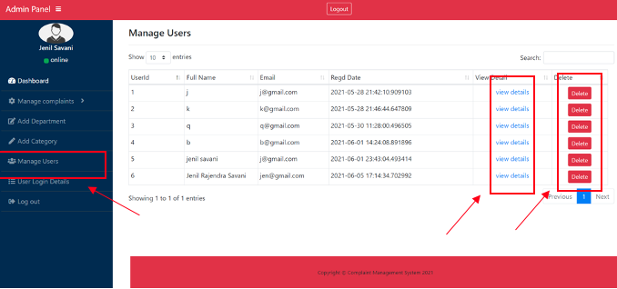

##### Admin Logout

For Admin to logout form the system, he can access the logout feature from two places:

- Admin can click on the “logout” button which is placed on the top of dashboard.
- On the other hand, Admin can logout by clicking the “logout” button placed on the side navigation panel of the admin dashboard.

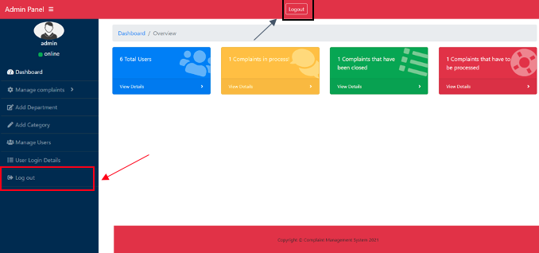

#### Cloud Engineer Role

After Successful Login of Cloud Engineer, Cloud Engineer dashboard is displayed which is as follows:
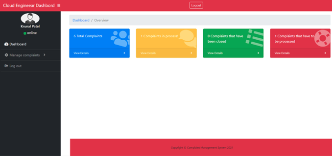

##### Manage Assigned user Complaints

To Manage assigned complaints, Cloud Engineer can manage complaints by clicking onto the manage complaint button which is on the side navigation bar, or he can directly click onto the complaint status bar present on the main dashboard.
The following displays the no. of ways one can manage the complaints:
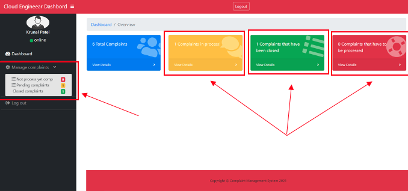

If an admin recently assigns a new complaint to the cloud engineer, then this complaint is displayed in the red colour status bar in the cloud engineer’s dashboard.
If the complaint is already assigned to the cloud engineer and it is in progress, then that complaint is displayed with yellow colour status bar in cloud engineer’s dashboard.
If the assigned complaint is already resolved by the cloud engineer, then that complaint is displayed with green colour status bar in cloud engineer’s dashboard.

##### Manage Not Yet Process Complaints

To manage or access the new complaint, cloud engineer needs to click onto the red colour status bar in the dashboard and after that a new page is displayed.
In the not yet process page, Cloud engineer needs to click onto the “view details” button to further view detailed information regarding the issue which user faces.
The following displays the Not yet process page:
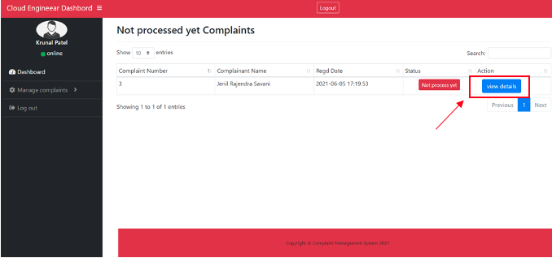

On clicking onto the “view details” button, the following page is displayed.
Cloud Engineer reads out the issue which user faces.
After thorough reading Cloud Engineer clicks on to the “Action” button where he further decides whether to close the complaint if the complaint is invalid or to make it in progress if it is valid.
Along with this action, he also adds remarks or send message to the user about the issue or the progress of the complaint.
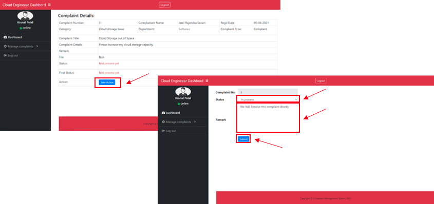

##### Manage “In Progress” Complaints

The in-progress complaint can now be access via yellow status bar button which is there in the cloud engineer dashboard.
On clicking onto the yellow status bar button, a database is displayed where cloud engineer can see each of the “In progress” complaints.
Cloud engineer needs to click on to “view details” with specific complaint,

On clicking on to that link the following screen is displayed where cloud engineer can see the user messages and can take action to close the complaint by entering the remarks.
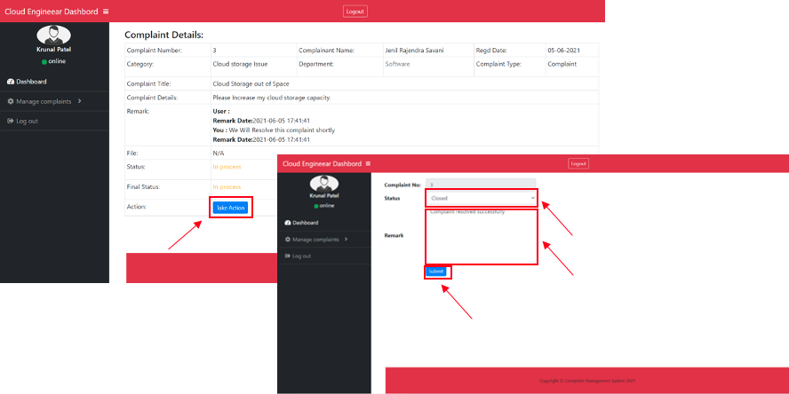

##### Cloud Engineer Logout

As a cloud Engineer you can logout like an Admin. Click [here](#Admin-Logout).

#### User Role

On successful login of user, user dashboard is displayed which is as follows:
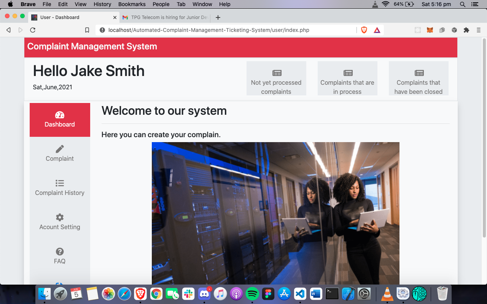

##### Lodge Complaint in User Dashboard

For Lodging a complaint into the system, please click on to the complaint symbol as displayed into the user dashboard.
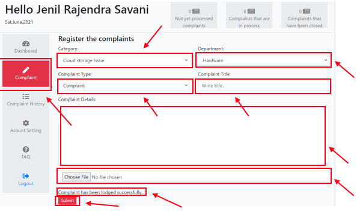

Please Select the different categories and department where there is issue with. After selecting those things, please enter the Complaint title and complaint details and then click onto the submit Button.

On successful lodgement of the complaint a notification is of successful complaint registration is displayed.

###### Complaint Status displayed in the User dashboard.

After lodging the complaint by the user, the status of the complaint is displayed on the status bar which is placed at the top.
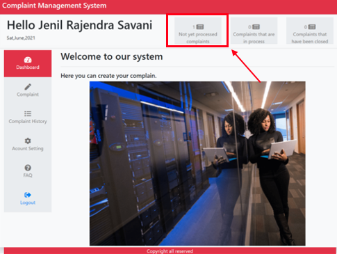

##### User Complaint History

To view the lodged complaints, click on to the complaint history button displayed into the navigation button on the user dashboard.
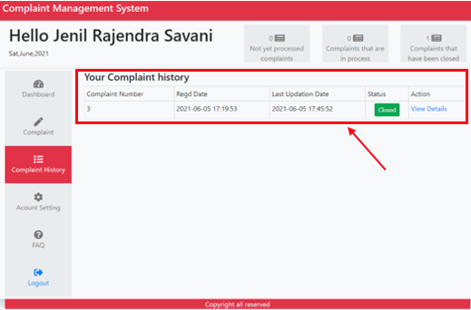

To view the details regarding the complaint please click on to the View Details button.

The following screen is displayed on clicking the view Details button:
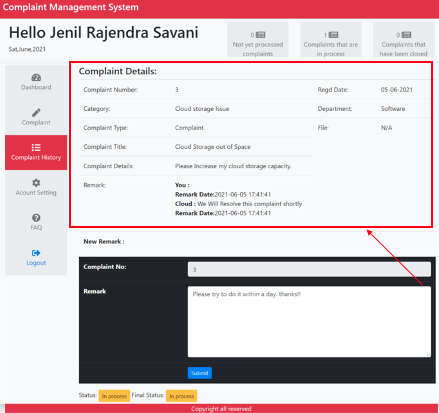

In this screen, complaint details including Complaint_type, Complaint_title, Complaint_Number, Complaint_details, and remarks are displayed.

User can also access the messaging through entering the message into the remark section and submit it by clicking the submit button:
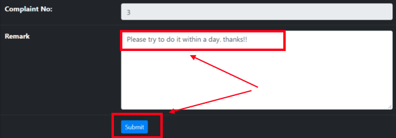

##### Change Profile Setting

To change the profile setting click on to the Account Setting button on the user dashboard.

User can change his/her name and can update his or her profile image.

After changing the things, User need to click on the update button to successfully update the details.
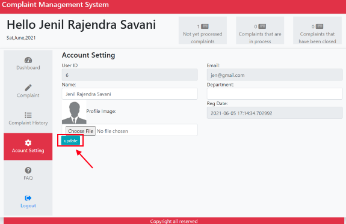

##### Access FAQ Page

To access the FAQ page, please click on to the FAQ button on the side navigation panel of User dashboard which is as shown below:
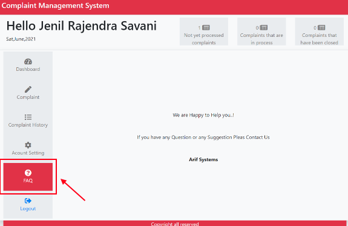

##### User Logout

To logout from the system, user needs to click on the logout button which placed on the last side of the navigation button. The Logout button is displayed below:
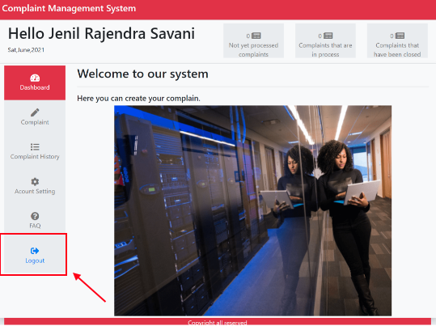

## Notes

- XAMPP Version 8.0.6-0
