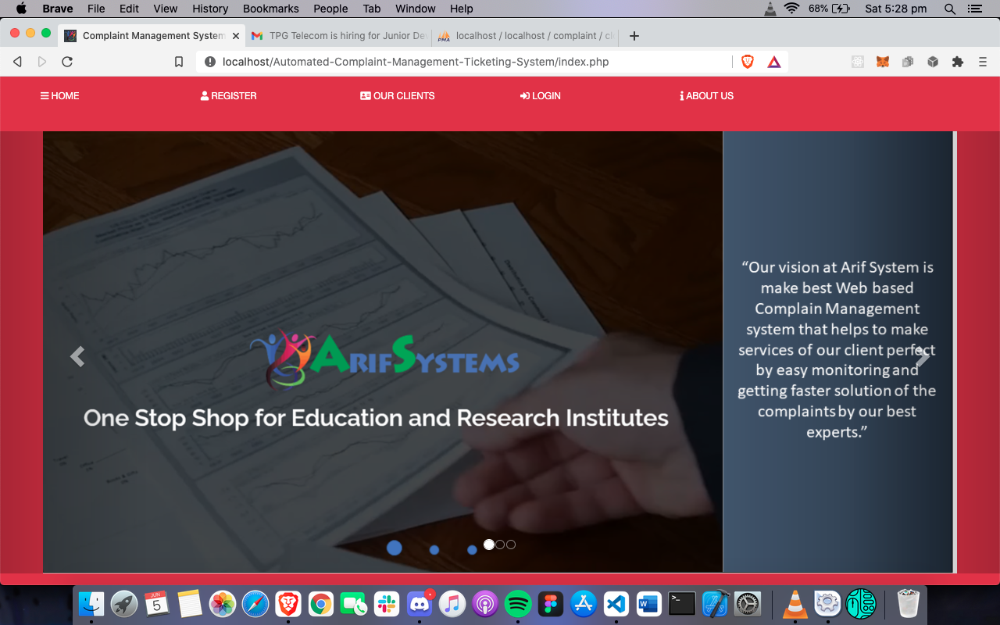
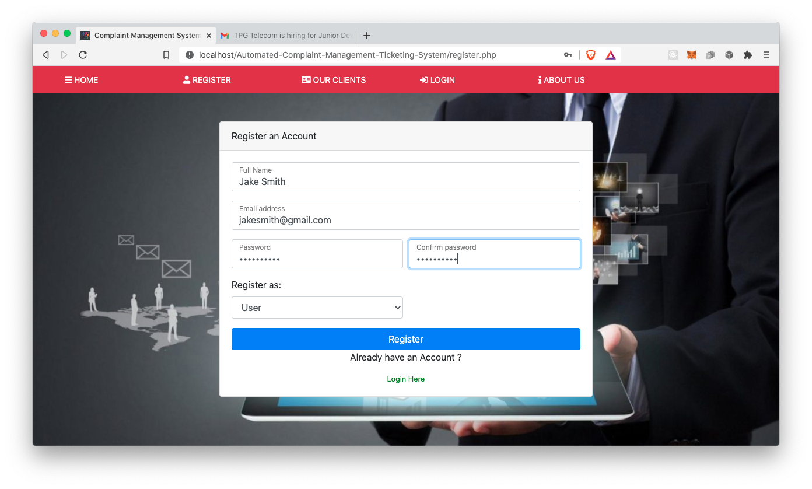
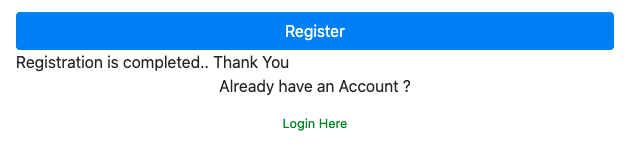
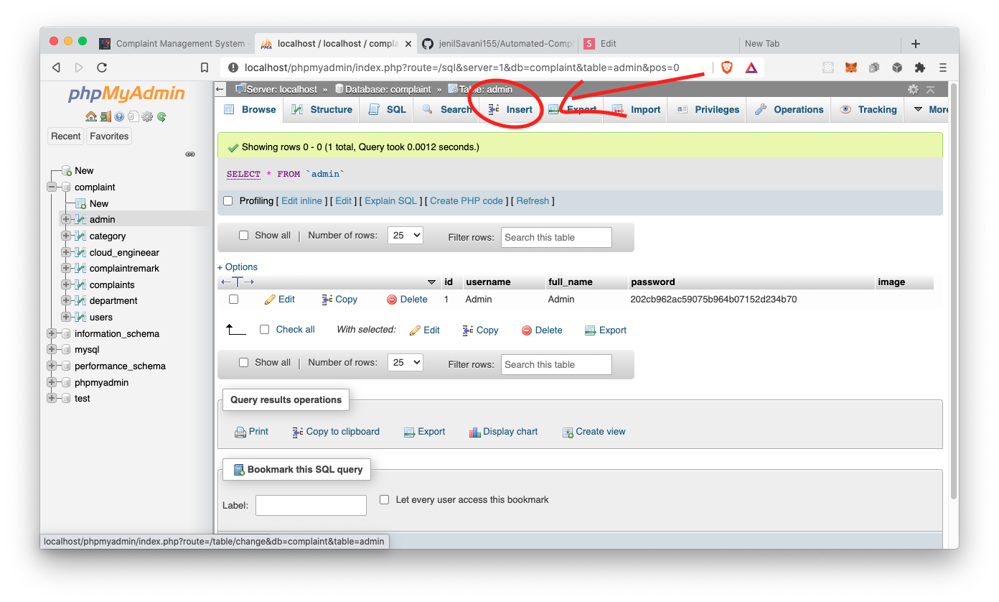
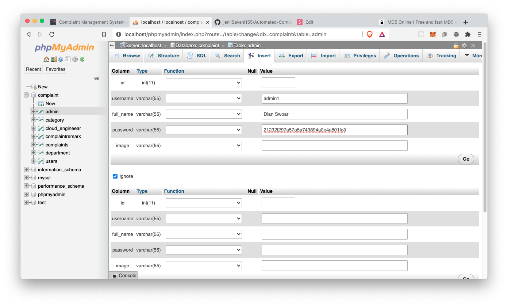

# Automated Complaint Management Ticking System

## Table of Content

1. [Introduction](#Introduction)
2. [Installation Guide](#Installation-Guide)
   - [Required Software](#Required-Software)
   - [Installation Guide](#INstallation-Guide)
3. [User Manuel](#User-Manuel)
   - [Registration](#Registration)
     - [User Registration](#User-Registration)
     - [Cloud Engineer Registration](#cloud-Engineer-Registration)
     - [Admin Registration](#Admin-Registration)
   - [Login](#Login)
   - [User Roles](#User-Roles)
     - [Admin Role](#Admin-Role)
     - [Cloud Engineer Role](#Cloud-Engineer-Role)
     - [User Role](#User-Role)
4. [Notes](#Notes)
5. [Glossary](#Glossary)

## Introduction

## Installation Guide

For this app we will need [XAMPP](https://www.apachefriends.org/download.html) to setup the database MySQL and Apache Web server to run the php file.

### Required Software

- [XAMPP](https://www.apachefriends.org/download.html)
- [Git](https://git-scm.com/)

### Installation Steps

After installing Git and XAMPP clone the repo in the `htdocs` folder.

For MacOS go to `Users/username/Application/XAMPP/htdocs`


For Windows go to `C:/xampp/htdocs`


For Linux distor place the project in `/opt/lampp/htdocs/`

```bash
git clone https://github.com/jenilSavani155/Automated-Complaint-Management-Ticketing-System
```

Run MySQL Database and Apache Server from XAMPP on Manage Servers tab.


Open up MySQL by going to [`http://localhos t/phpmyadmin/`](http://localhost/phpmyadmin/) then import the `complaint.sql` file in this url [`http://localhost/phpmyadmin/index.php?route=/server/import`](http://localhost/phpmyadmin/index.php?route=/server/import) from the projects root folder. This will import the database we have created and all the tables in complaint database.


Now go to
[`http://localhost/Automated-Complaint-Management-Ticketing-System/index.php`](http://localhost/Automated-Complaint-Management-Ticketing-System/index.php)

The app is now up and running.

For hosting on the cloud please follow this document from official [XAMPP website](https://www.apachefriends.org/hosting.html)

## User Manuel

Go to [`http://localhost/Automated-Complaint-Management-Ticketing-System/index.php`](http://localhost/Automated-Complaint-Management-Ticketing-System/index.php)

Where you will be greeted by our Homepage.


As requested but the client we have divided the users in three different roles with different levels of authorities and functionalities.

### Registration

You can register as a User or a Cloud Engineer but you will need to wait for a while for the Admin to approve your account, you can contact your Admin after you have registered.

#### User Registration

To register as a user enter your `Full Name`, `Email`, `Password` that you want and confirm that password in the text boxes labeled respectively. Before you click on the registration button make sure the `Register As` has been set to`User`.

Here is an example.


The website will show this message if the registration was a success.


#### Cloud Engineer Registration

For a cloud engineer you can follow the above user registration but change the `Register As` to `Cloud Engineer`.


After that you will be see this message if there are no errors.


#### Admin Registration

For Admin we recommend to have them register right after they are registered. For this we will have to go through MySQL to add them. Go to [`http://localhost/phpmyadmin/index.php?route=/sql&server=1&db=complaint&table=admin&pos=0`](http://localhost/phpmyadmin/index.php?route=/sql&server=1&db=complaint&table=admin&pos=0) this is the table for admin accounts.

Click on `Insert` tab on the `Dashboard` to add a new admin.


After that add the `username`, `full_name` and the MD5 encrypted string of the password the admin wants for the account as shown below. For encryption we recommend this [website](https://www.md5online.org/md5-encrypt.html).

And click go that the end to add that account.

### Login

### User Roles

#### Admin Role

#### Cloud Engineer Role

#### User Role

## Notes

## Glossary

| Word | Description          |
| ---- | -------------------- |
| repo | repository for short |
