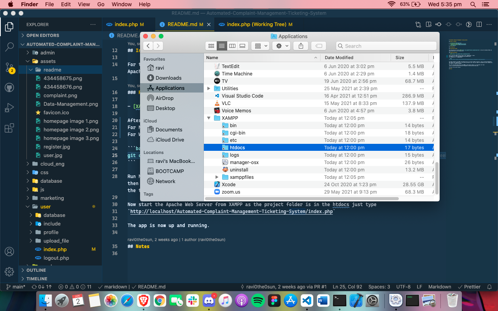
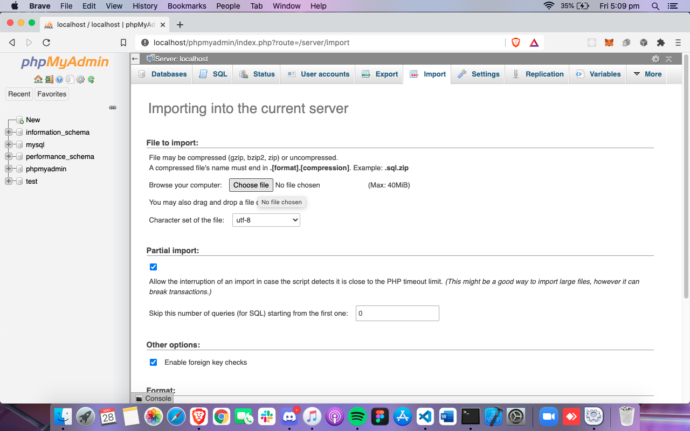

# Automated Complaint Management Ticking System

## Table of Content

1. [Introduction](#Introduction)
2. [Installation Guide](#Installation-Guide)
   - [Required Software](#Required-Software)
3. [User Manuel](#User-Manuel)
4. [Notes](#Notes)

## Introduction

## Installation Guide

For this app we will need [XAMPP](https://www.apachefriends.org/download.html) to setup the database MySQL and Apache Web server to run the php file.

### Required Software

- [XAMPP](https://www.apachefriends.org/download.html)

After installing XAMPP clone the repo in the `xampp/htdocs` folder.

For MacOS go to `Users/username/Application/XAMPP/htdocs`


For Windows go to `C:/xampp/htdocs`


```bash
git clone https://github.com/jenilSavani155/Automated-Complaint-Management-Ticketing-System
```

Run MySQL Database from XAMPP from Manage Servers tab. Open up MySQL by going to [`http://localhost/phpmyadmin/`](http://localhost/phpmyadmin/) then import the `complaint.sql` file in this url [`http://localhost/phpmyadmin/index.php?route=/server/import`](http://localhost/phpmyadmin/index.php?route=/server/import) from the projects root folder. This will import the database we have created and all the tables in complaint database.


Now start the Apache Web Server from XAMPP as the project folder is in the htdocs just go to this link
[`http://localhost/Automated-Complaint-Management-Ticketing-System/index.php`](http://localhost/Automated-Complaint-Management-Ticketing-System/index.php)

The app is now up and running.

## User Manuel

## Notes
